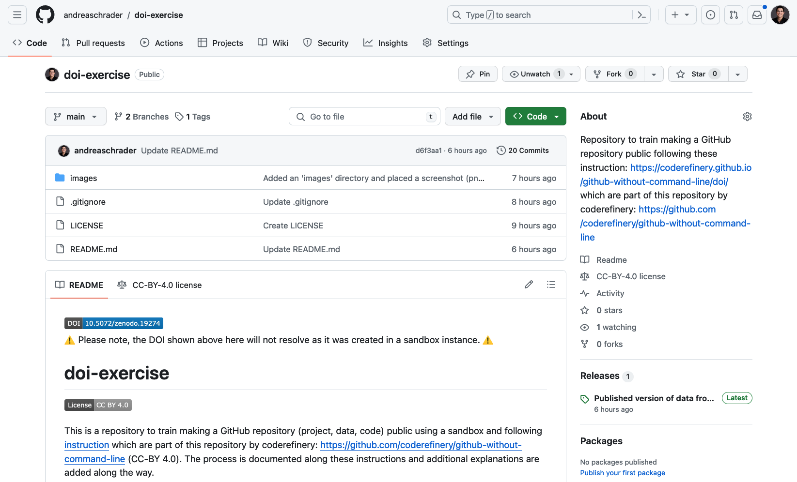
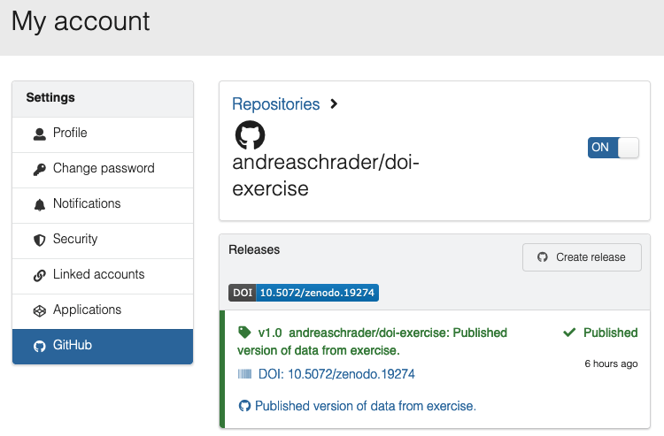

[](https://sandbox.zenodo.org/doi/10.5072/zenodo.19273)  
⚠️ Please note, the DOI shown above here will not resolve as it was created in a sandbox instance. ⚠️

# doi-exercise

[](https://creativecommons.org/licenses/by/4.0/)

This is a repository to train making a GitHub repository (project, data, code) public using a sandbox and following [instruction](https://coderefinery.github.io/github-without-command-line/doi/) which are part of this repository by coderefinery: https://github.com/coderefinery/github-without-command-line (CC-BY 4.0).
The process is documented along these instructions and additional explanations are added along the way. 

As I am anyway doing this exercise right now, I decided to leave some comments target to others who 
- plan or have to do the same
- have already create and contributed to at least a simple GitHub repository
- have seen a LICENSE and .gitignore file before
- but are not very experienced with GitHub repositories so far over all.

Maybe this is useful for anybody.
Please note, links used here are as of January, 3rd, 2024 and might not be updated thereafter.

## Step 1 - Create an example repository

### Create the repository with a README.md
In the first step this public repository was created with a description ("About") and this [`README.md file`](./README.md):



### .gitignore
I added a [`.gitignore`](./\.gitignore) file to avoid pushing files into this public repository which are not relevant for its content. For this, I selected the Visual Studio `.gitignore` version.  

I also add the `.DS_Store` file to the repository's `.gitignore` file for macOS.  

### LICENSE & references
Moreover, I added a [LICENSE](./LICENSE) and referenced the instructions I used for this exercise in this README file - in particular including the repository in which these instructions reside.  
This was done, because the coderefinery repository has a CC-BY 4.0 license and, at least for this repository, I did not find another citation.  
Therefore, I want to ensure proper referencing and enable others to reuse content of this repository by knowing about the license.  

#### Adding a LICENSE
In my work, I often use the CC-BY 4.0 license. This license is not provided as a choice by GitHub when setting up the repository. Therefore, I simply add a text file named LICENSE into the root of my repository and copy the text of the CC-BY 4.0 license into it.  
In addition, to make it as easy as possible for others who might want to reuse any content of my repository, I add a CC_BY 4.0 badge right at the beginning of the repository's README file: 

```
[](https://creativecommons.org/licenses/by/4.0/)
```

**CC-BY 4.0**:
tbc

**root**:
tbc

### Upload example data
There are different ways to add data to a GitHub repository. For example, we can use the `Add file` button in the browser or adding a file to a local cloned version of the repository followed by the respective `git add`, `git commit -m "Added my_file."`and `git push`commands.
Also, you can just drag an drop a file in [VS Code](https://code.visualstudio.com/) into the directory structure of your repository of choice.

Here, I cloned the repository and continued as described above. If not just cloned before the following steps are conducted, it makes sense to first pull all remote changes: `git pull`. As I protected my main branch, at least in this example, I first created a branch for this (`git switch -c upload_example_data`) performed the different steps and pushed as follows: (`git push --set-upstream origin upload_example_data`).

Eventually, after checking that everything is as expected, I do the pull request (PR) and merged the upload_example_data branch into the main branch and eventually delete the upload_example_data branch.

## Step 2
As described [here](https://coderefinery.github.io/github-without-command-line/doi/), I headed over to the Zenodo Sandbox Instance. First, I logged into the Sandbox Instance of Zenodo which needs access to your public repository. If this is with another organization it will need access to the respective public repositories as well. You or the respective owner have to decide on this.  

Next, I activate it at Zenodo (sandbox) by selecting it in the overview of public repositories (set to "on").
After reloading the page, it should be shown under "Enabled Repositories".

**sandbox**:
tbc

**zenodo**:
tbc

**doi**:
tbc

## Step 3

Going back to the doi-exercise repository, I selected `Releases` in the right sidebar and `Create a new release` on the next page.

Choose a tag: Here you can enter a version for your repository. For continuous development carefully select the format of the selected version.
I chose v1.0

Target: This is the branch of the repository selected for the release. 
I chose `main`.

Add a `Release title` and optionally a more detailed descriptions including differences e.g to a previous release in subsequent releases can be added.

Eventually conclude with `Publish release`.

I changed back to Zenodo (sandbox) and refreshed the page. In my case the Releases were directly updated:



## Step 4

A badge at the begin of the README of the respective repository can directly guide you to the citation at Zenodo and displays the doi (here it is only the sandbox version for the test).

To obtain the code that you have to insert into the README.md file, go to zenodo (sandbox) click on the badge for the repository and copy the line for `Markdown` - see also at the begin of this repository.

After committing the changes, it will be displayed like [here](./README.md).

## Other steps

With this, your project is citable and you obtained a persistent identifier for it. However, you might want to add specific metadata which could not be captured by Zenodo or was not available from your GitHub account. You might also want to support the user with an easily extractable citation or update the version at Zenodo upon a new release. Below are some thoughts and suggestions on a supportive citation file.

## CITATION

Here, I did not yet add a citation file in order to avoid ambiguity with respect to the reference to the instruction I followed:  
https://coderefinery.github.io/github-without-command-line/doi/  

The instructions worked smoothly in my hands. Thanks to the authors!  


When deciding for a citation file, according to the GitHub and Zenodo documentation, a [`CITATION.cff` file](https://docs.github.com/en/repositories/managing-your-repositorys-settings-and-features/customizing-your-repository/about-citation-files) or a [`.zenodo.json` file](https://developers.zenodo.org/#github) can be added to the root of the repository in order to read proper metadata with respect to authors, affiliations and e.g. licenses and funding.  

<br/>

If the chunks of text and collected information above were supportive for you, please ***cite and star ⭐ this repository*** :smile:  
Thanx!